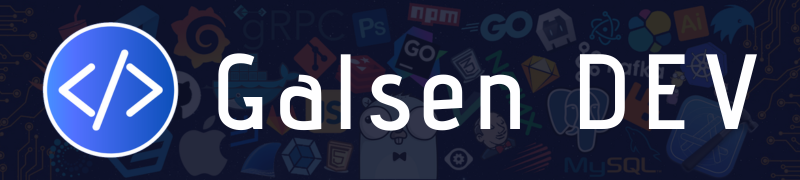

# Hello world 👋🏽

We are Building the largest community of Senegalese developers 🇸🇳 🚀

**Galsen DEV** is a community that brings together Senegalese developers with the aim of creating an ecosystem conducive to creation and sharing as a developer and popularizing programming throughout Senegal. We also set ourselves the goal of helping beginners and people wishing to join the field of programming.

Join our community on our Discord server 👇🏽

You can join us also on :

[-000000?style=for-the-badge&logo=x&logoColor=white>)](https://x.com/galsendev221)  

  

Feel free to check out our GitHub repositories and add your contribution to our projects 🙌🏾
